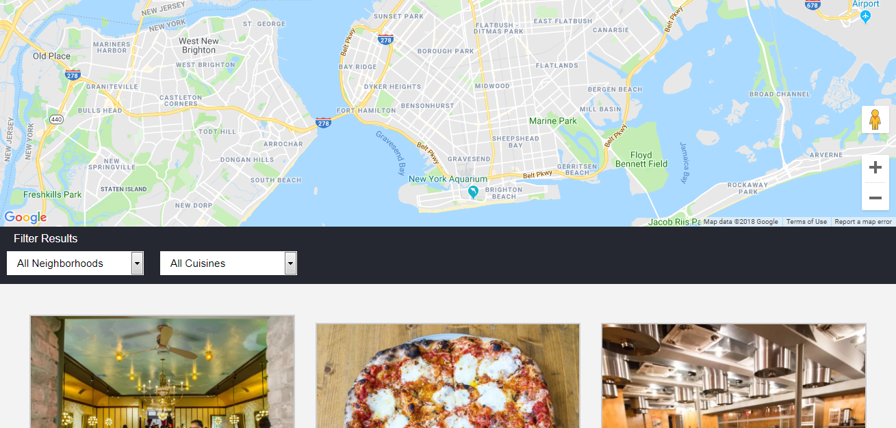

# Restaurant Review App
## Description
* This project is part of the Udacity Front-End Developer Nanodegree program.

# Project Overview
* For the Restaurant Reviews projects, you will incrementally convert a static webpage to a mobile-ready web application. In Stage One, you will take a static design that lacks accessibility and convert the design to be responsive on different sized displays and accessible for screen reader use. You will also begin converting this to a Progressive Web Application by caching some assets for offline use.

# Basic app features and functionalities.

* You will be able to view restaurants at all locations
* Comments and reviews about restaurants are available.
* Restaurants details such as location and operating hours can be viewed.
* You can also view restaurants at a specific district or cuisine.
# Click [here](https://danrejsa.github.io/Javascript-offline-first-service-worker-Restaurant-Reviews-App-/) to view App

## ScreenShot

